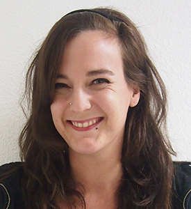

# Über mich

Ich habe mich schon immer gerne mit Worten befasst. Als Kind ohne Fernseher aufgewachsen, tauchte ich schon bald in Bücherwelten ab. Deshalb auch meine Entscheidung, nach dem gestalterischen Vorkurs und einem angeknabberten Kunststudium Sprachen und Literatur zu studieren. Ins Texten bin ich nach dem Studium reingeschlittert – oder soll ich eher sagen reingetippelt –, irgendwie ja auch naheliegend, als sprach- und schreibbegeisterter Kopf, dessen halbe Seele für die Gestaltung schlägt.
{: .fs-6 .fw-300 }

## CV

- seit Mai 2019: vollständig freischaffend

- Mai 2018–Mai 2019: Junior Texterin & Konzepterin bei der Yellow Werbeagentur, Basel

- Okt. 2017–April 2018: Junior Texterin bei der Kommunikationsagentur Agentur 01, Bern

- Mai 2017–Okt. 2017: Textpraktikum bei der Werbeagentur Maxomedia, Bern

- seit 2016: freiberufliche Tätigkeiten. Übersetzungen, Texte, Korrektur, Transkription, Nachhilfe

- Feb. 2014–Dez. 2016: Masterstudium Literaturwissenschaften: Spanisch und Englisch, Basel. Master of Arts

- Aug. 2012–Dez. 2012: Austauschsemester in Oklahoma, USA

- Sept. 2010–Dez. 2013: Bachelorstudium Linguistik & Literatur: Spanisch und Englisch, Basel. Bachelor of Arts

- Sept. 2009–Aug. 2010: Studiengang Kunst, Fachhochschule Nordwestschweiz, Basel

- Nov. 2007–Apr. 2009: Gestalterischer Vorkurs IAC, Zürich. Diplom

- Aug. 2002–Juli 2006: Abitur mit Schwerpunktfach Spanisch, Wattwil

## Weiterbildungen und Interessen

- Feb. 2020: selbständige Weiterbildung in Content-Marketing, Texten fürs Web, SEO

  - [Think Content!](https://www.rheinwerk-verlag.de/think-content_4127/){:target="_blank"} von Miriam Löffler
  - [Die SEO Masterclass: Lerne Suchmaschinenoptimierung von A-Z](https://www.udemy.com/course/die-seo-masterclass/){:target="_blank"} von Udemy
  
- Sept. 2018: LSA Bootcamp (Leading Swiss Agencies). Praktische und theoretische Weiterbildung im Bereich Strategie, Kreation, Medienrecht usw.

- seit 2011: diverse Kurse an der SfG Basel. Siebdruck, Illustration, Animation, Lithografie
