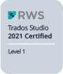
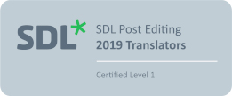

# Angebot

Als ausgebildete Werbetexterin liegt mein Fokus auf dem Texten. Aufgrund meines Studiums übersetze ich zudem Texte von Englisch, Französisch und Spanisch auf Deutsch. Und da ich etwas allergisch auf Rechtschreibfehler und stilistische Stolpersteine bin, biete ich mit dem gleichen Enthusiasmus ein Korrektorat und Lektorat Ihrer Texte an.
{: .fs-6 .fw-300 }

## Text

- Werbung: Headlines, Longcopy, Claims etc.
- Websites inklusive SEO
- Lokalisierung von Websites für den Schweizer Markt
- redaktionelle Beiträge
- Blogbeiträge

**Zertifikat Professional Writing Workshop, Text Akademie Zürich. Prädikat Prüfung: mit sehr gutem Erfolg bestanden**
**Zertifikat CAS Marketing Writer – UX Writing, Text Akademie/HWZ Zürich. Schlussnote: 5.5**

## Übersetzung & Transkreation

- von Englisch, Spanisch und Französisch auf Deutsch

## Korrektorat & Lektorat

- für fehlerfreie und stilsichere Texte
- bestehende Texte redigieren

## Transkription

- bspw. von Videos auf Schweizerdeutsch in Standardhochdeutsch

## Jetzt kontaktieren unter
[info@leabosshart.ch](mailto:info@leabosshart.ch){: .btn .btn-purple }

<!-- Google tag (gtag.js) -->

