# Texte für Werbung

Kinderbooklets, Postkarten, Webtexte, Flyer und klassische Anzeigen: geistige Beweglichkeit, eine schnelle Auffassungsgabe und Vielfältigkeit sind beim Werbetexten gefragt.
{: .fs-6 .fw-300 }

## Spielzeug Welten Museum Basel: Kinderbooklets

Diese Kinderbooklets für die Sonderausstellungen «Mut zum Hut» und «Taschen — Ikonen und Wertanlagen» des Kunden Spielzeug Welten Museum Basel schrieb ich während meiner Anstellung als Texterin bei der Yellow Werbeagentur.

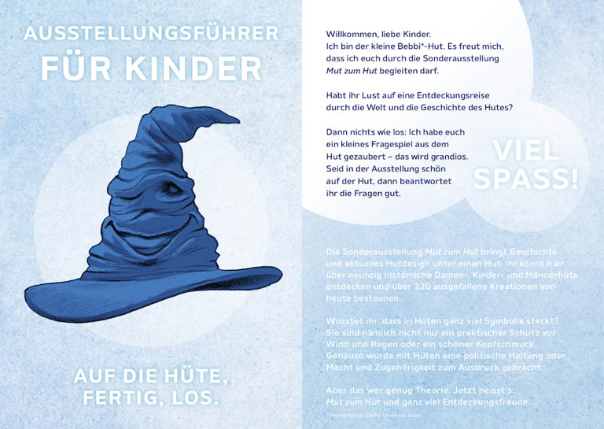
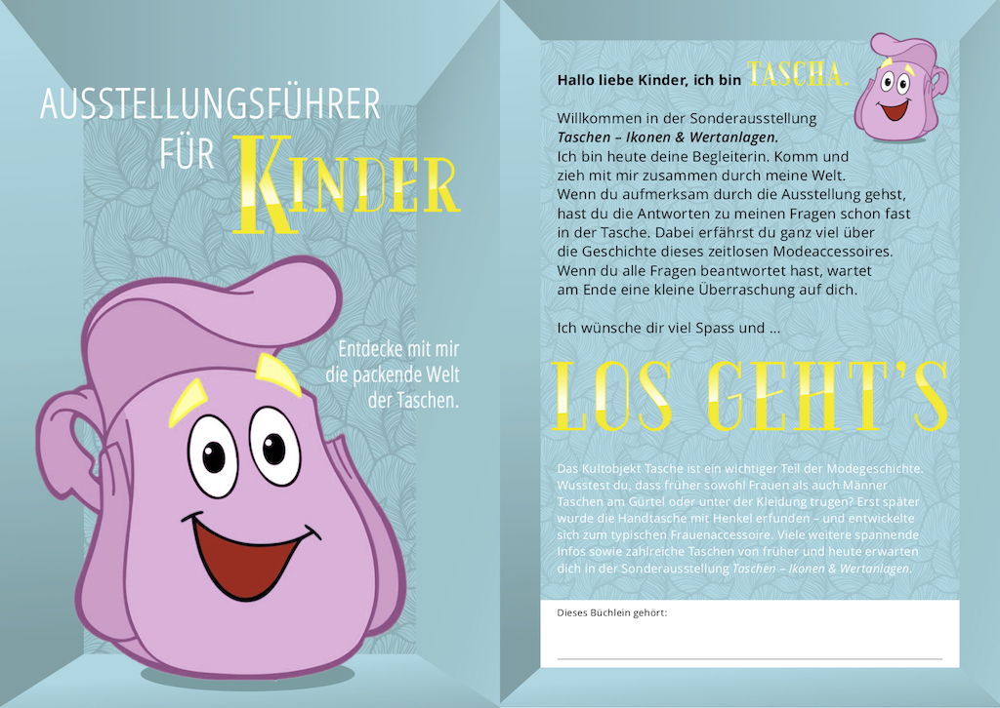

## VHS Schwarzenburg: Postkarten

Die Auftraggeberin VHS Schwarzenburg wollte auf witzige Art und Weise auf ihr vielfältiges Kursangebot hinweisen. In Zusammenarbeit mit der selbständig tätigen Grafikerin Silvia Rohrbach entstanden diese Postkarten.

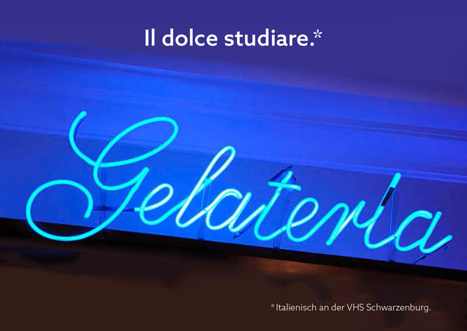
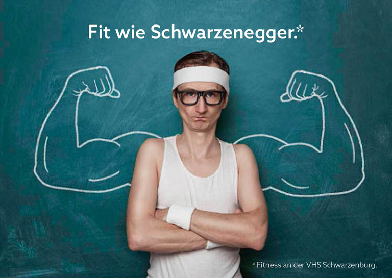
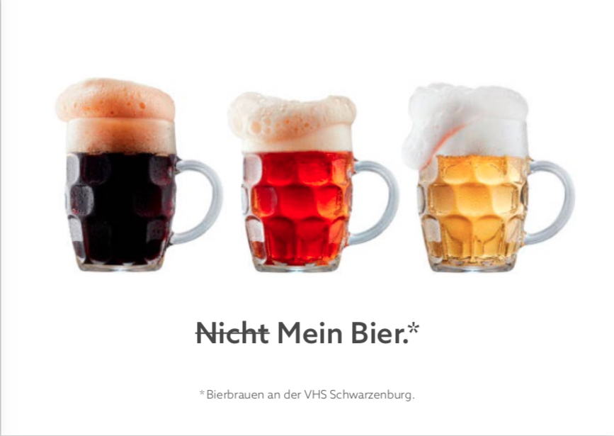
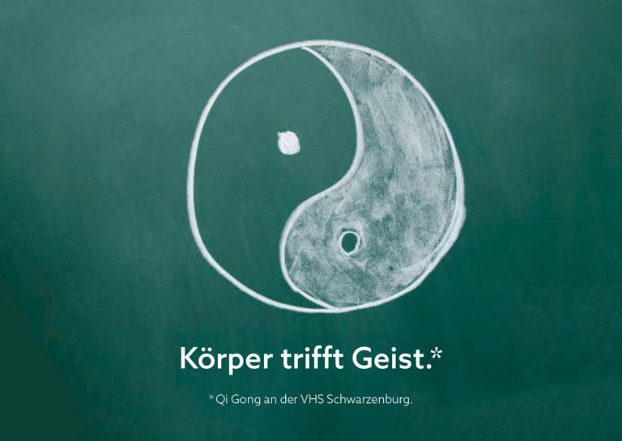
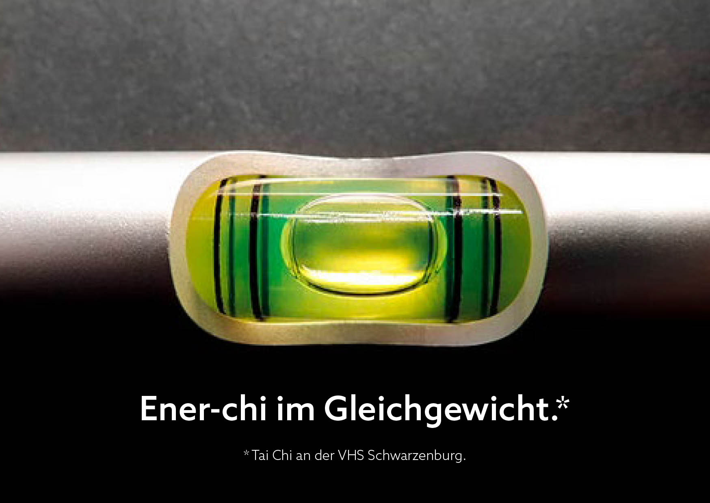

## Kestenholz: Anzeige und Flyer

Eine Print-Anzeige für Kestenholz, die Oldtimer-Liebhaber anspricht — nämlich die Mitglieder des Mercedes-Benz Veteranenclub Schweiz.

Der Flyer bewarb einen Oster-Malwettbewerb für Kinder. Er wurde an die Kunden von Kestenholz verschickt und lag in den Standorten des Automobilhändlers auf.

Beides entstand bei der Yellow Werbeagentur.

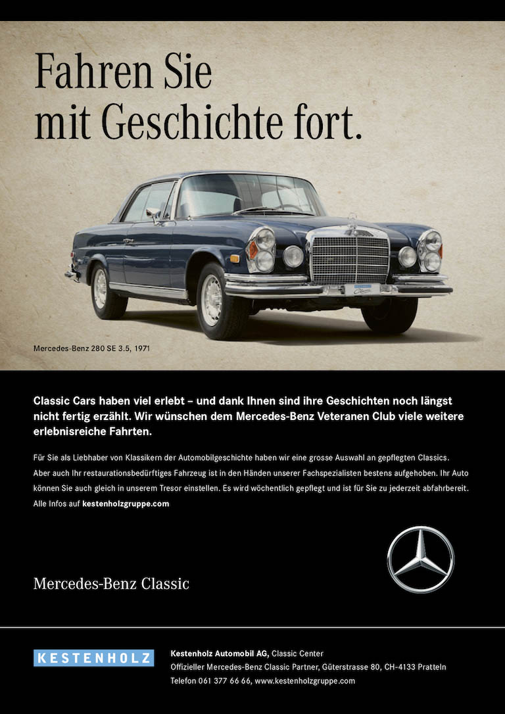
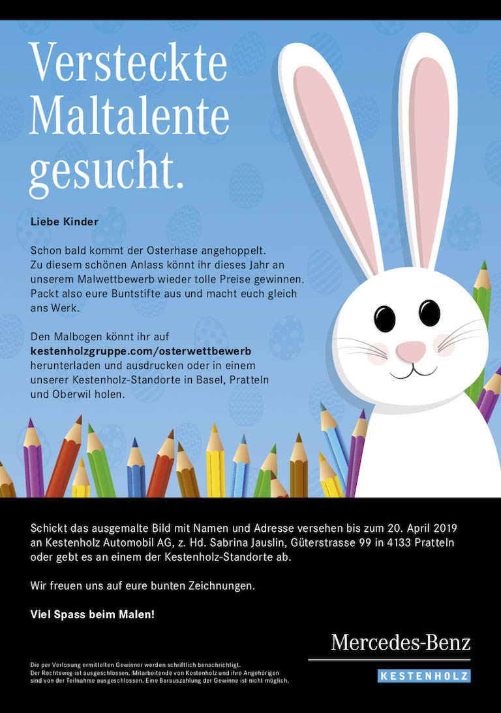

## Otto Hofstetter: Lehrlingsplattform

«Gate to the future» ist eine Lehrlingsplattform, wo angehenden Auszubildenden die Berufe bei der Otto Hofstetter AG schmackhaft gemacht werden. Die Texte verfasste ich während meiner Anstellung bei der Yellow Werbeagentur.

[Hier geht’s zur Plattform](https://www.otto-hofstetter.swiss/de/jobs/gate2future/){:target="_blank"}

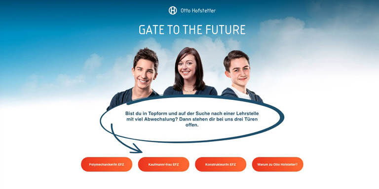
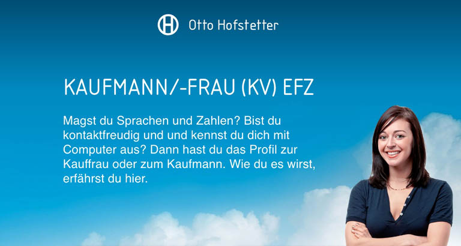
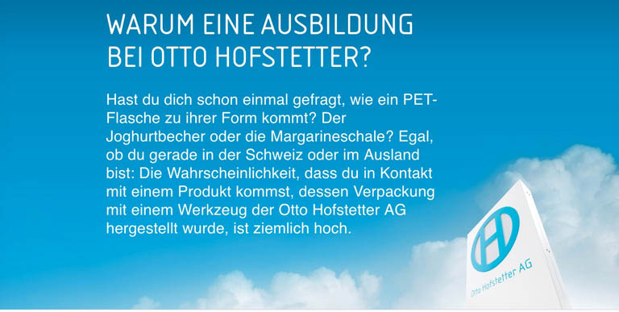

## Barto: Datenerfassung für Landwirte

Die Website Barto.ch möchte Bäuerinnen und Landwirten die betriebliche Datenerfassung vereinfachen. Ich verfasste als Texterin bei der Agentur 01 für den Kunden Barto AG alle Texte dafür.

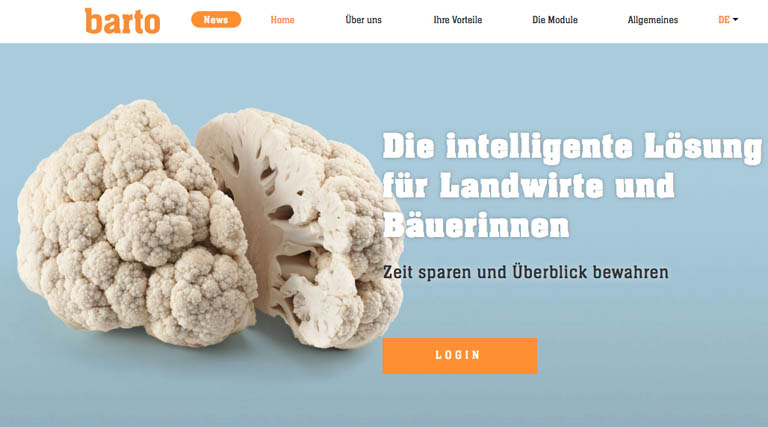
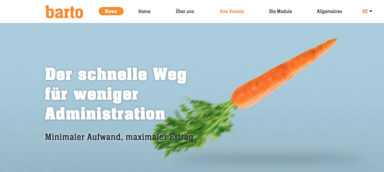

## SBB: Erlebniskompass gleis7.ch

Die Plattform «Erlebniskompass» von Gleis 7 motivierte Jugendliche zu Ausflügen und Erlebnissen, die sie danach online bewerten konnten. Alle zwei Monate winkte eine neue «Challenge» mit Erlebnissen, bei denen auch beliebte YouTuber/innen mitmachten. Ich erarbeitete und schrieb die Inhalte der zwei Challenges «Budget» und «Sonnentanz» als Textpraktikantin bei der Maxomedia. Bei der Wahl der Erlebnisse war ich vollkommen frei.

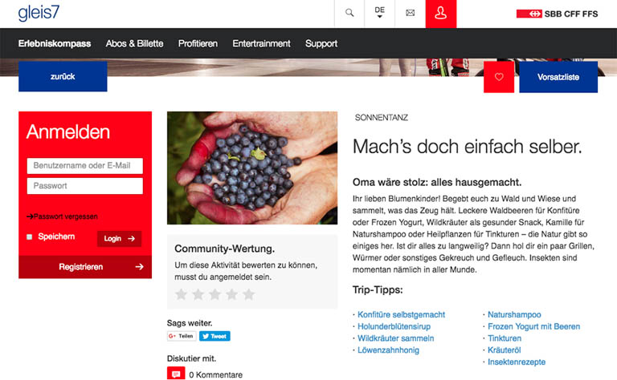
