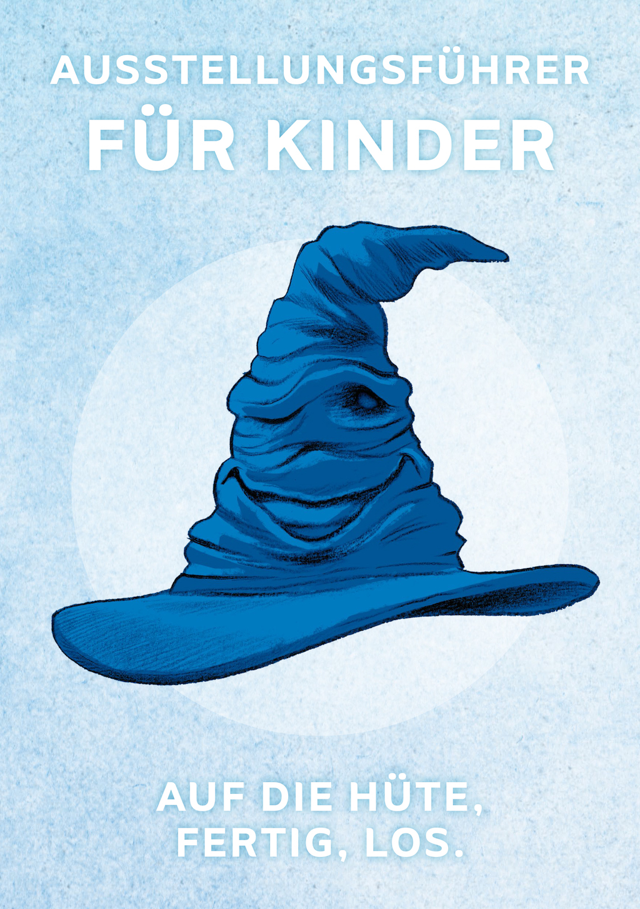
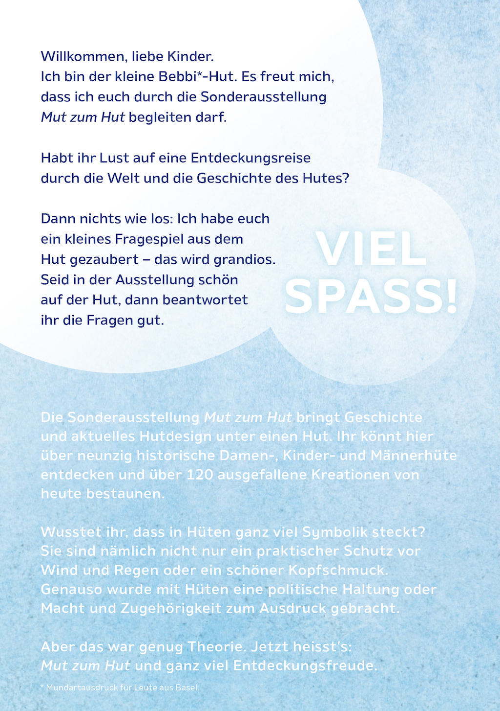
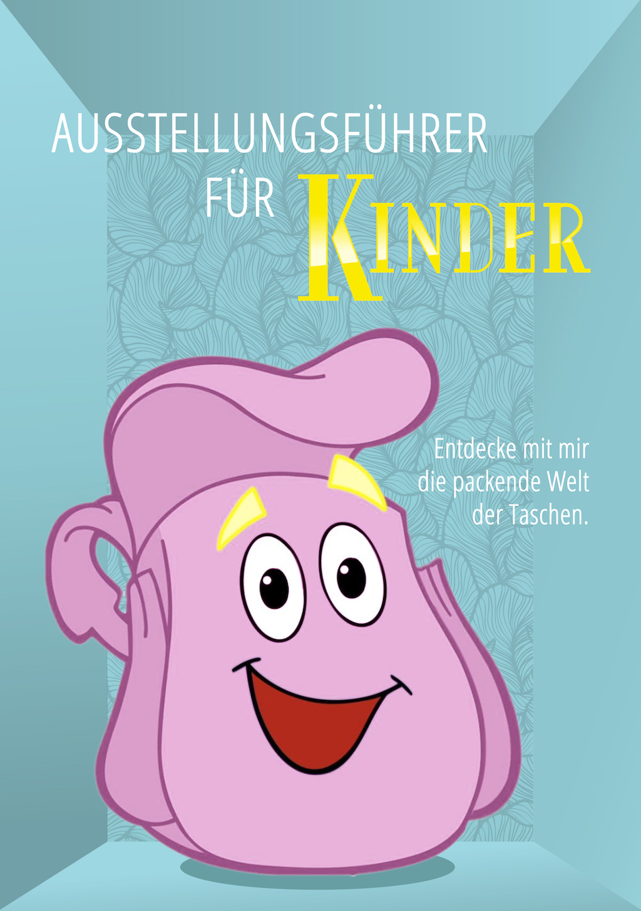
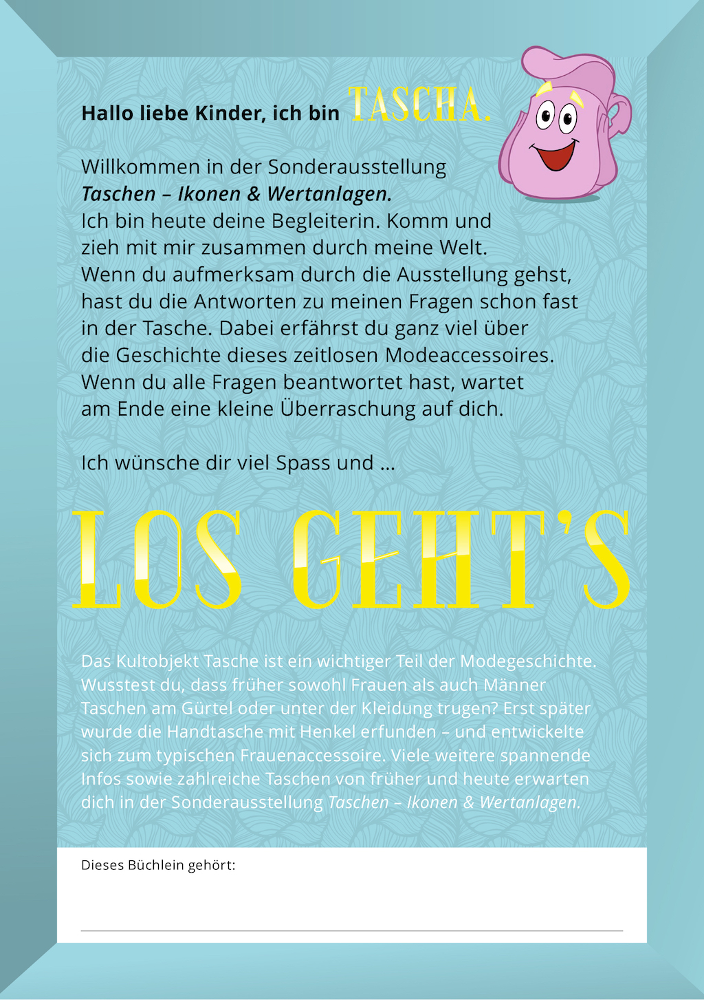

# Texte für Werbung

## Spielzeug Welten Museum Basel: Kinderbooklets

Diese Kinderbooklets für die Sonderausstellungen «Mut zum Hut» und «Taschen — Ikonen und Wertanlagen» des Kunden Spielzeug Welten Museum Basel schrieb ich während meiner Anstellung als Texterin bei der Yellow Werbeagentur.

<!--  -->
<!--  -->

<!--  -->
<!--  -->

## VHS Schwarzenburg: Postkarten

Die Auftraggeberin VHS Schwarzenburg wollte auf witzige Art und Weise auf ihr vielfältiges Kursangebot hinweisen. In Zusammenarbeit mit der selbständig tätigen Grafikerin Silvia Rohrbach entstanden diese Postkarten.

<!--  -->
<!--  -->

## Kestenholz: Anzeige und Flyer

Eine Print-Anzeige für Kestenholz, die Oldtimer-Liebhaber anspricht — nämlich die Mitglieder des Mercedes-Benz Veteranenclub Schweiz.

Der Flyer bewarb einen Oster-Malwettbewerb für Kinder. Er wurde an die Kunden von Kestenholz verschickt und lag in den Standorten des Automobilhändlers auf.

Beides entstand bei der Yellow Werbeagentur.

## Otto Hofstetter Lehrlingsplattform (Yellow Werbeagentur)

Texte für die Lehrlingsplattform für den Kunden Otto Hofstetter AG der Yellow Werbeagentur.

[Link zu der Lehrlingsplattform](https://www.otto-hofstetter.swiss/de/jobs/gate2future/){:target="_blank"}

## Barto AG (Agentur01)

Die Plattform barto.ch möchte Landwirten die betriebliche Datenerfassung vereinfachen. Ich habe alle Texte verfasst.

[barto.ch](https://www.barto.ch/){:target="_blank"}

## Tillate Paid Post für Erlebniskompass (Maxomedia)

Um die Europa-Challenge für den Erlebniskompass von Gleis 7 zu bewerben, verfasste ich einen Paid Post, der auf Tillate publiziert wurde.

## Gleis 7 SBB (Maxomedia)

Für die Plattform "Erlebniskompass" von Gleis 7 durfte ich die Erlebnisse der zwei Challenges "Budget" und "Sonnentanz" texten. Bei der Wahl der Erlebnisse war ich vollkommen frei.

