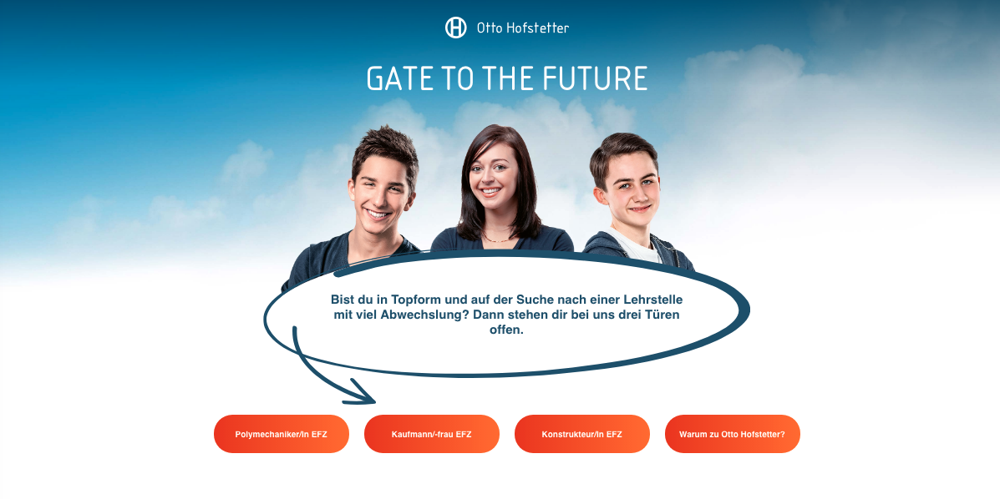
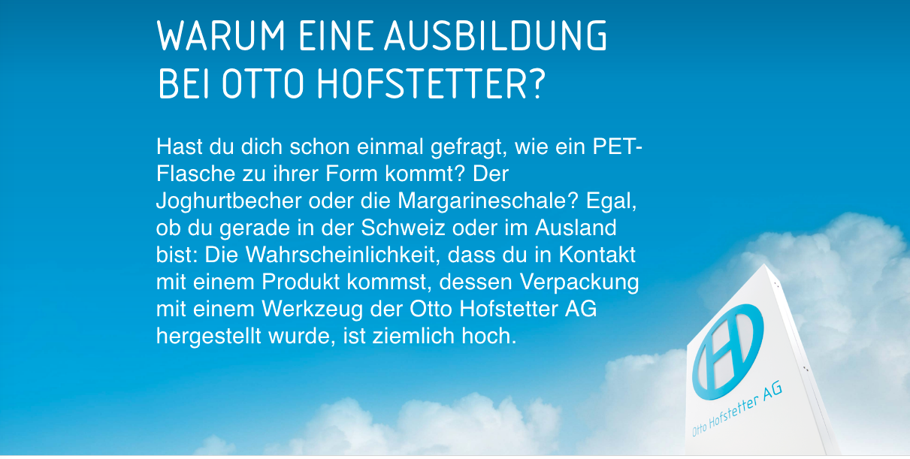
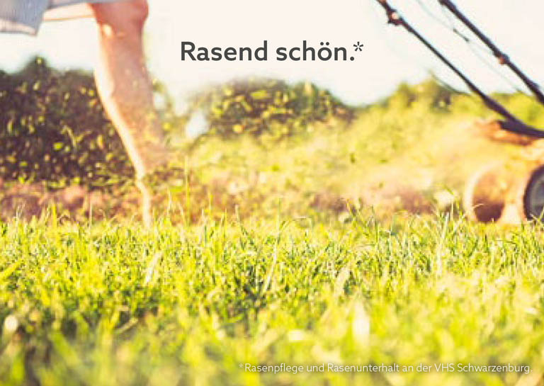
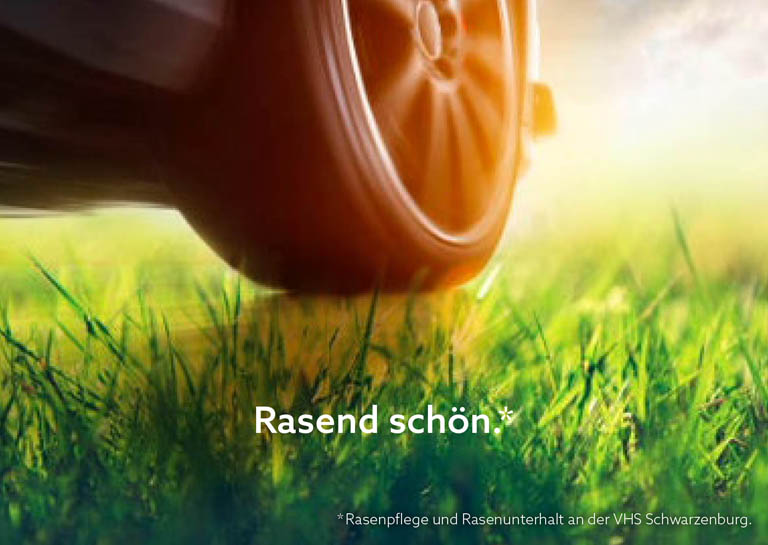
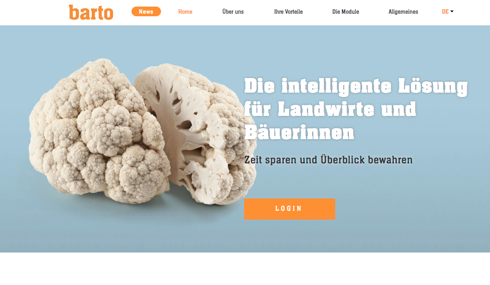
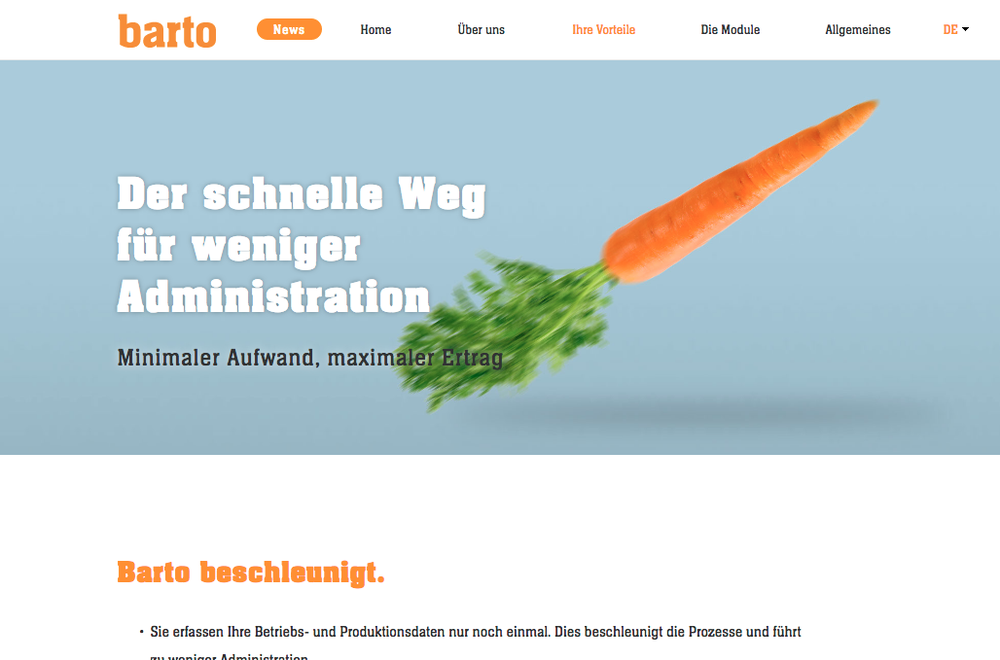
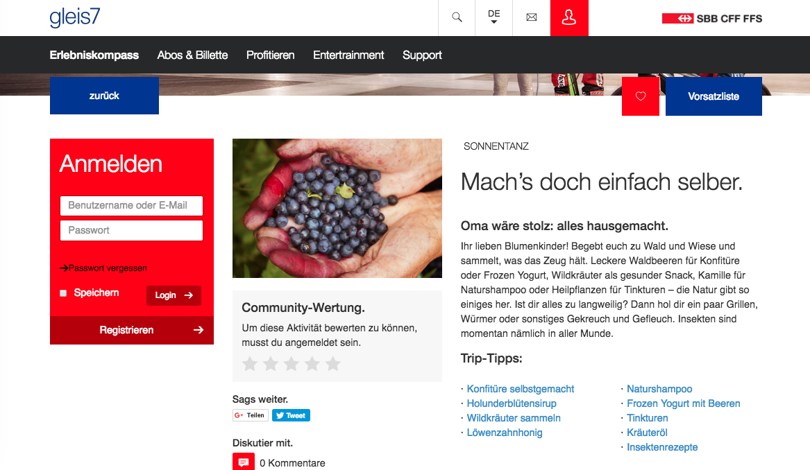
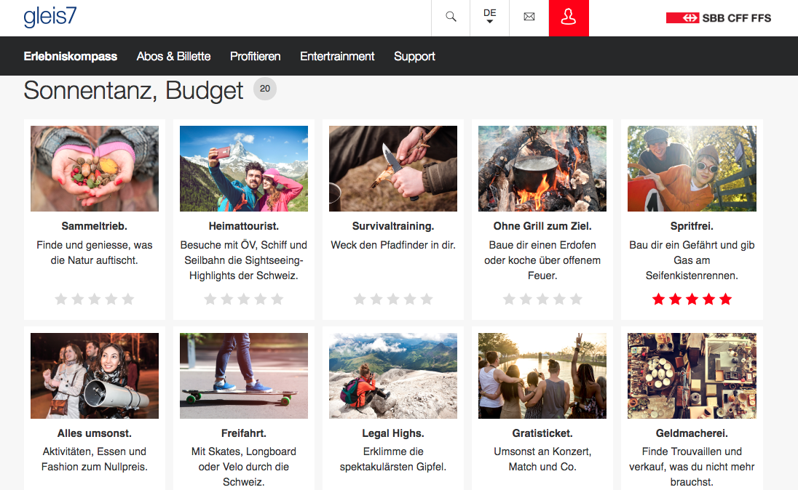

# Texte für Werbung

## Otto Hofstetter Lehrlingsplattform (Yellow Werbeagentur)

Texte für die Lehrlingsplattform für den Kunden Otto Hofstetter AG der Yellow Werbeagentur.

[https://www.otto-hofstetter.swiss/de/jobs/gate2future/](https://www.otto-hofstetter.swiss/de/jobs/gate2future/){:target="_blank"}

## VHS Schwarzenburg: Postkarten (freiberuflicher Auftrag)

Die Auftraggeberin VHS Schwarzenburg wollte auf witzige Art und Weise auf ihr vielfältiges Kursangebot hinweisen. In Zusammenarbeit mit der selbständig tätigen Grafikerin Silvia Rohrbach entstanden diese Postkarten. 

## Barto AG (Agentur01)

Die Plattform barto.ch möchte Landwirten die betriebliche Datenerfassung vereinfachen. Ich habe alle Texte verfasst. 

Kompetenzen: Headlines, Copy

[https://www.barto.ch/](https://www.barto.ch/){:target="_blank"}

## Tillate Paid Post für Erlebniskompass (Maxomedia)

Um die Europa-Challenge für den Erlebniskompass von Gleis 7 zu bewerben, verfasste ich einen Paid Post, der auf Tillate publiziert wurde.

## Gleis 7 SBB (Maxomedia)

Für die Plattform "Erlebniskompass" von Gleis 7 durfte ich die Erlebnisse der zwei Challenges "Budget" und "Sonnentanz" texten. Bei der Wahl der Erlebnisse war ich vollkommen frei. 

Kompetenzen: Recherche, Texten

