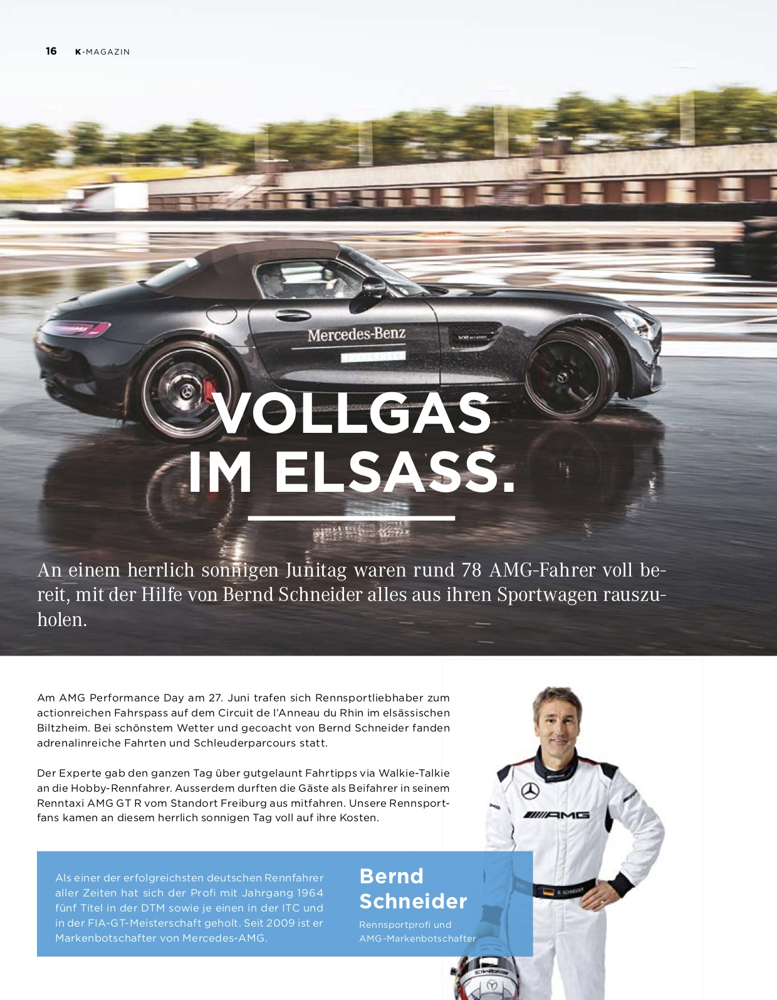
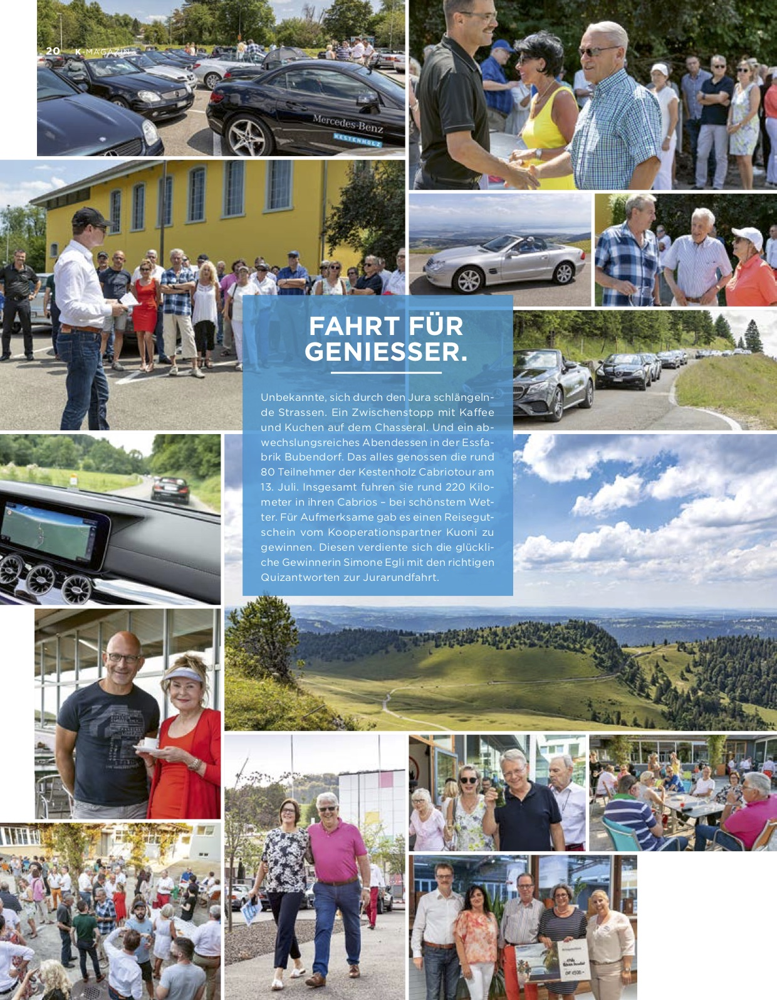
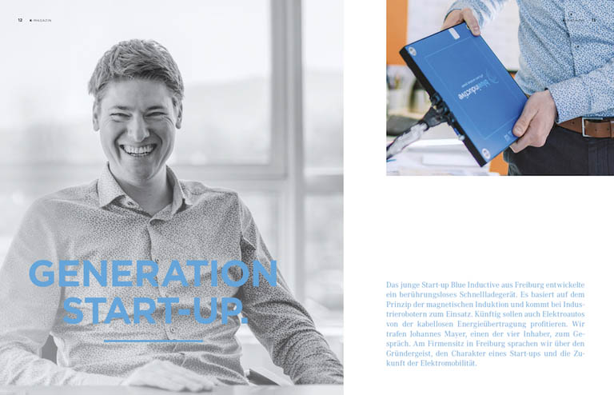
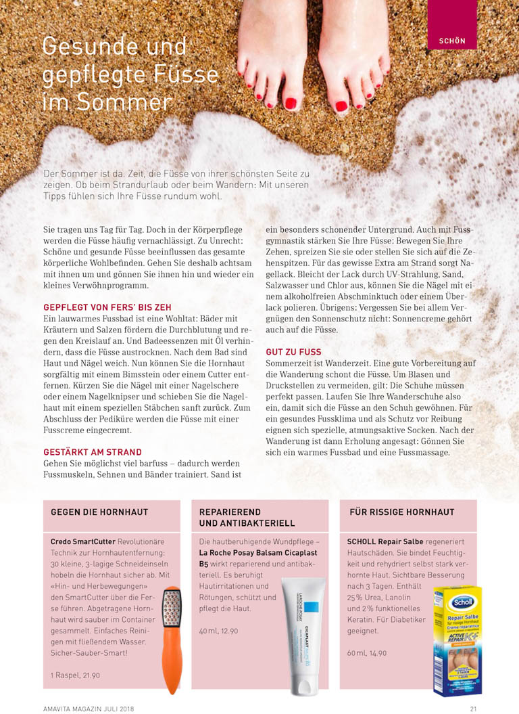
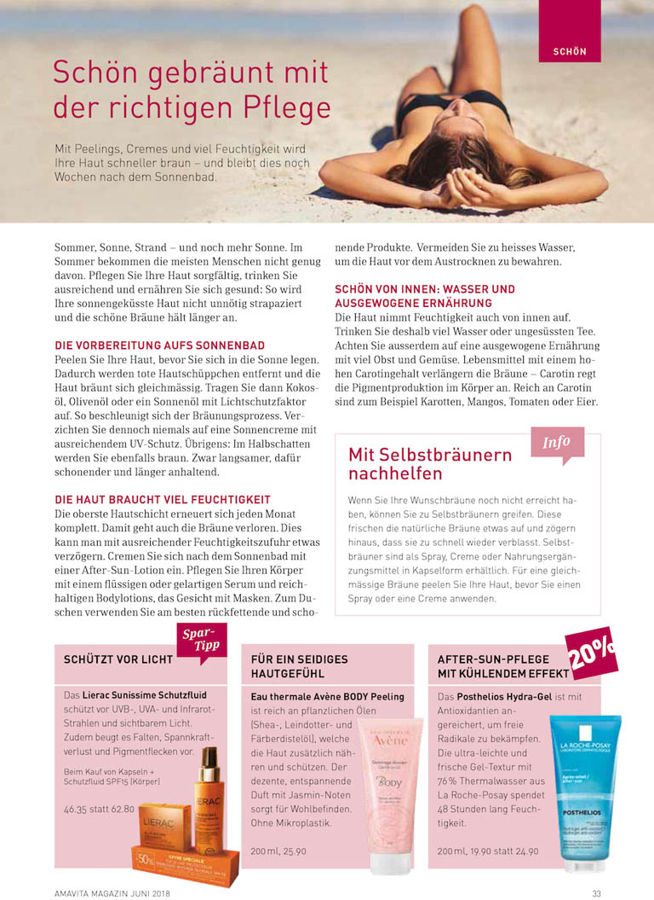
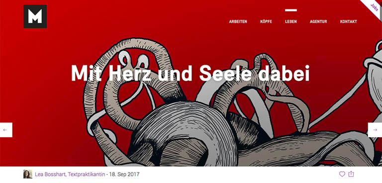

# Redaktionelle Texte

Ob schnelle Autos, erneuerbare Energien oder Arbeitsplatztausch: Hier finden Sie ein paar Einblicke in meine redaktionellen Texte mit Tiefgang.
{: .fs-6 .fw-300 }

## Kestenholz: K-Magazin

Für das Magazin des Kunden Kestenholz erstellte ich während meiner Tätigkeit bei der Yellow Werbeagentur redaktionelle Beiträge, meistens auf Basis von Interviews. Hochaktuell: Das Start-up Blue Inductive aus Freiburg erfand ein berührungsloses Schnellladegerät, das die Zukunft der Elektromobilität prägen könnte.

## Amavita: Amavita Magazin

Bei der Agentur 01 verfasste ich für die Kundin Amavita redaktionelle Beiträge für die Rubriken «Schön» und «Gesund».

## eev: Print-Magazin elitec und Online-Magazin e-tec

Die eev ist die führende Marketing- und Servicedienstleisterin für das Schweizer Elektrogewerbe.

Für das Online-Magazin e-tec und das Print-Magazin elitec schrieb ich für diese Kundin der Agentur 01 diverse Beiträge.

Die Magazine richten sich an die Kunden von Elektro-Installationsunternehmen und Haushaltsgeräte-Fachgeschäften. Beispiel aus dem Print-Magazin elitec: «Eine Strategie für mehr Nachhaltigkeit».

Links zu den Artikeln im Online-Magazin e-tec:

- [Eine Strategie für mehr Nachhaltigkeit](https://www.e-tec.swiss/de/alternative-energien/eine-strategie-fuer-mehr-nachhaltigkeit/){:target="_blank"}
- [Mit smarter Beratung zum intelligenten Zuhause](https://www.e-tec.swiss/de/gebaeudeautomation/mit-smarter-beratung-zum-intelligenten-zuhause/){:target="_blank"}
- [Sorgfältig planen, erfolgreich umbauen](https://www.e-tec.swiss/de/basis-installation/sorgfaeltig-planen-erfolgreich-umbauen/){:target="_blank"}
- [Grund zum Strahlen: die Photovoltaikanlage](https://www.e-tec.swiss/de/alternative-energien/grund-zum-strahlen-die-photovoltaikanlage/){:target="_blank"}

## Maxomedia: Blogbeitrag

Ein Beitrag für den Maxomedia-Blog, den ich als Texpraktikantin schrieb. Es geht dabei um einen internationalen Jobtausch in zwei Agenturen.

[Link zum Beitrag](https://maxomedia.ch/leben/mit-herz-und-seele-dabei){:target="_blank"}

