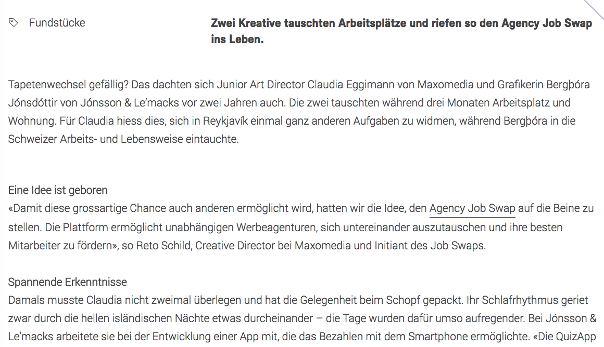

# Redaktionelle Texte

Ob Autos, gebräunte Haut, Smart Home oder Arbeitsplatztausch: Hier finden Sie ein paar Einblicke in meine redaktionellen Texte. Viel Spass beim Stöbern.
{: .fs-6 .fw-300 }

## K-Magazin (Yellow Werbeagentur)

Interviews und redaktionelle Beiträge im Rahmen meiner Festanstellung bei der Yellow Werbeagentur.

## Amavita (Agentur01)

Redaktionelle Beiträge für die Rubriken "Schön" und "Gesund"

## Artikel E-Tec (Agentur 01)

Für den Kunden EEV verfasste ich bei der Agentur 01 unter anderem diesen redaktionellen Beitrag zur Hausautomation; ausserdem diverse Artikel für das Printmagazin Elitec.

Links zu den Artikeln auf dem e-tec Online-Magazin:

- [Eine Strategie für mehr Nachhaltigkeit](https://www.e-tec.swiss/de/alternative-energien/eine-strategie-fuer-mehr-nachhaltigkeit/){:target="_blank"}
- [Mit smarter Beratung zum intelligenten Zuhause](https://www.e-tec.swiss/de/gebaeudeautomation/mit-smarter-beratung-zum-intelligenten-zuhause/){:target="_blank"}
- [Sorgfältig planen, erfolgreich umbauen](https://www.e-tec.swiss/de/basis-installation/sorgfaeltig-planen-erfolgreich-umbauen/){:target="_blank"}
- [Grund zum Strahlen: die Photovoltaikanlage](https://www.e-tec.swiss/de/alternative-energien/grund-zum-strahlen-die-photovoltaikanlage/){:target="_blank"}

## Blogbeitrag (Maxomedia)

Ein Beitrag für den Maxomedia-Blog über einen internationalen Jobtausch.

[Link zum Beitrag](https://maxomedia.ch/leben/mit-herz-und-seele-dabei){:target="_blank"}

