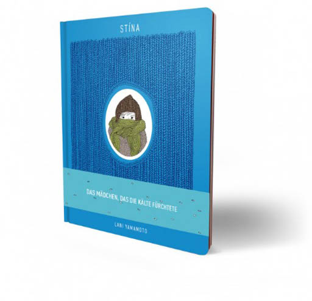
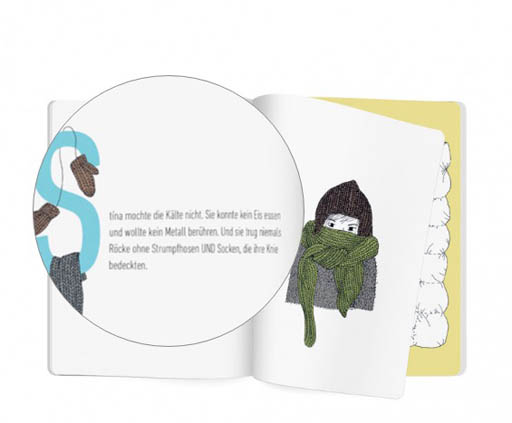
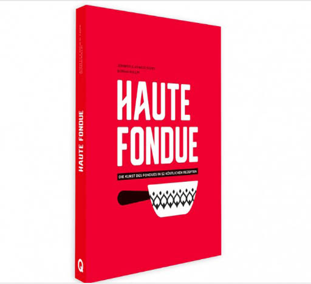
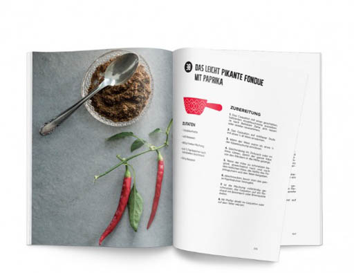

# Übersetzungen

Tinte und Feder werden für Übersetzungen von Englisch und Französisch auf Deutsch gezückt.
{: .fs-6 .fw-300 }

## Helvetiq Verlag: Kinderbuch «STÍNA» von Lani Yamamoto

Ein herzerwärmendes Buch über ein Mädchen, das die Kälte hasst und erfinderisch wird, um ihr zu entfliehen. Der zarte Illustrationsstil passt sehr gut zur Geschichte. Ich übersetzte diese von Englisch auf Deutsch.

## Helvetiq Verlag: Kochbuch «Haute Fondue» von Arnaud und Jennifer Favre

Das Schweizer Nationalgericht mal ganz anders — interpretiert in 52 aussergewöhnlichen Rezepten. Ich übersetzte das Kochbuch der Westschweizer Arnaud und Jennifer Favre von Französisch auf Deutsch.

