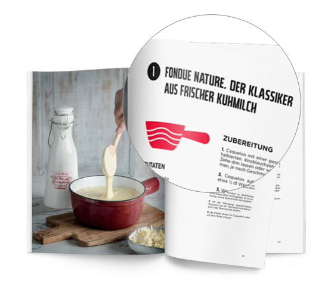

<!--  -->

# Übersetzungen

## Kinderbuch «STÍNA» von Lani Yamamoto, Übersetzung Englisch-Deutsch. Verlag: Helvetiq

## Kochbuch «Haute Fondue» von Arnaud und Jennifer Favre, Übersetzung Französisch-Deutsch. Verlag: Helvetiq

