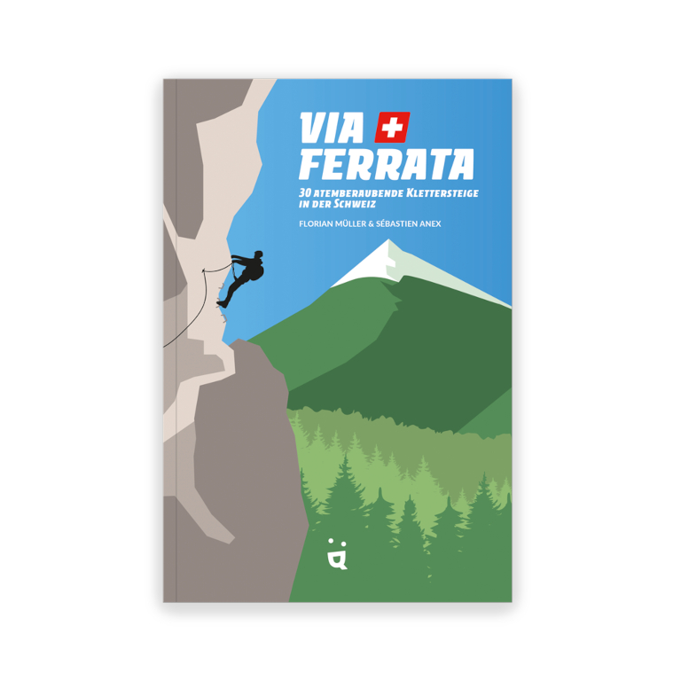

# Übersetzungen

Tinte und Feder werden für Übersetzungen aus dem Englischen, Französischen und Spanischen ins Deutsche gezückt.
{: .fs-6 .fw-300 }

## Helvetiq Verlag: Kinderbuch «Klang» von Cristina Cubells und Joana Casals

Ein lautmalerisches Kinderbuch, das Kinder dazu anregt, mit Klängen zu experimentieren. Hier konnte ich meine Leidenschaft für Comics voll und ganz ausleben. Übersetzt aus dem Spanischen ins Deutsche.

## Helvetiq Verlag: Outdoor-Buch «Via Ferrata» von Florian Müller und Sébastien Anex

Atemberaubende Klettersteige in der ganzen Schweiz, in einem Buch gebündelt. Beim Übersetzen dieses Buches vom Französischen ins Deutsche wurde mir manchmal regelrecht schwindlig, aber irgendwie hat es auch meine Abenteuerlust geweckt.

## Helvetiq Verlag: Kinderbuch «STÍNA» von Lani Yamamoto

Ein herzerwärmendes Buch über ein Mädchen, das die Kälte hasst und erfinderisch wird, um ihr zu entfliehen. Der zarte Illustrationsstil passt sehr gut zur Geschichte. Ich übersetzte diese aus dem Englischen ins Deutsche.

## Helvetiq Verlag: Kochbuch «Haute Fondue» von Arnaud und Jennifer Favre

Das Schweizer Nationalgericht mal ganz anders — interpretiert in 52 aussergewöhnlichen Rezepten. Ich übersetzte das Kochbuch der Westschweizer Arnaud und Jennifer Favre aus dem Französischen ins Deutsche.

