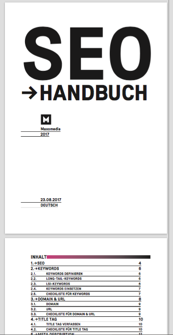
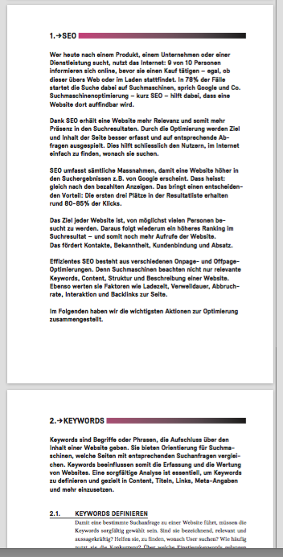
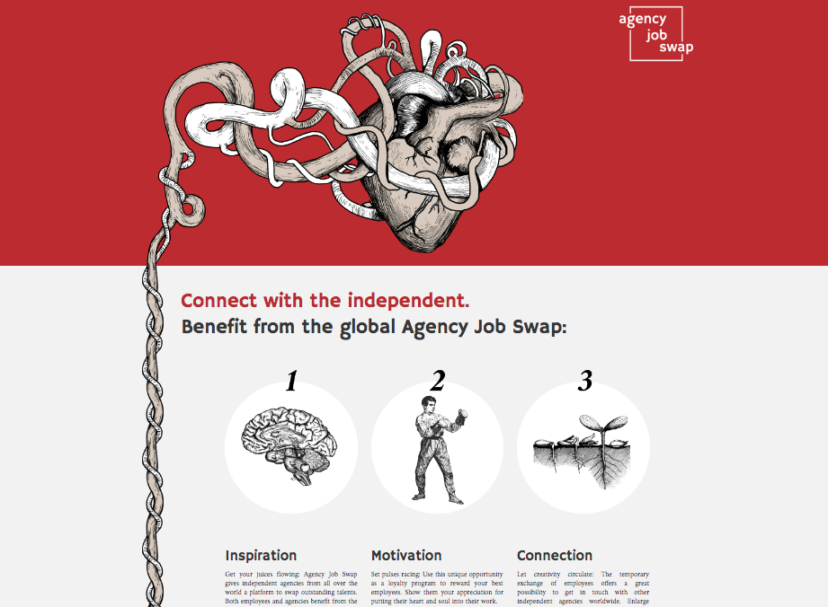

# Sonstige Projekte

## SEO Handbuch

Ursprünglich von einem Kunden in Auftrag gegeben, wurde daraus ein umfassendes Booklet, das dann auch anderen Kunden verkauft wurde. Ich durfte dem Kunden eine Schulung dazu geben, damit sie ihre Website im CMS selber SEO-gerecht optimieren können. 

Kompetenzen: Recherche, Strukturieren, logischer Aufbau, Schulung

## Agency Job Swap (Maxomedia)

Die Website Agency Job Swap ist bei der Maxomedia entstanden. Damit soll der Austausch zwischen Mitarbeitern internationaler Werbeagentur gefördert werden. Ich habe alle Texte geschrieben und das Projekt zusammen mit einem Grafiker konzipiert. 

Kompetenzen: Konzeption, Recherche, Naming, Texte auf Englisch

## MAX-Bier (Maxomedia)

Für unsere Kunden haben wir bei einer Brauerei ein extra Maxomedia-Bier namens MAX brauen lassen. Ich war während des ganzen Projekts dabei (Konzeption) und habe alle Texte verfasst.

Kompetenzen: Recherche, Konzeption, Texte

## Suppen-Leporello für Spoon Basel

Grafik: [NEKA](https://neka.ch/){:target="_blank"},
 Illustration: [Stephan Liechti](http://s-liechti.ch/){:target="_blank"},
 Siebdruck: [Hanspeter Arni](http://arnisiebdruck.ch/){:target="_blank"}

