# Sonstige Projekte

Gegen den Strom schwimmen: Projekte, die aus dem Raster fallen.
{: .fs-6 .fw-300 }

## Maxomedia: SEO-Handbuch

Die ursprüngliche Idee eines Kunden von Maxomedia war eine kurze SEO-Schulung. Daraus entwickelte sich aus Eigeninitiative — zusammen mit der Art Directorin & Senior Texterin Antonia Bekiaris und der Grafikpraktikantin Lea Aeschbacher — ein umfassendes Booklet. Dieses wurde später auch anderen Kunden verkauft. Ich gab dem Kunden die Schulung, damit er seine Website im CMS selber SEO-gerecht optimieren konnte.

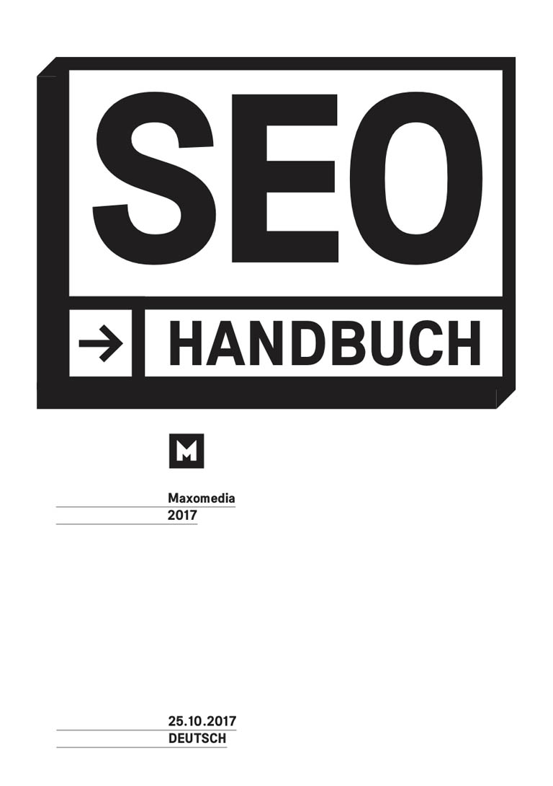
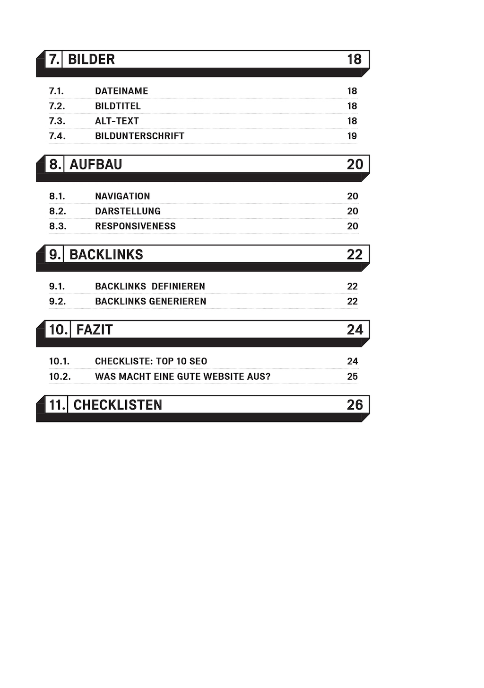
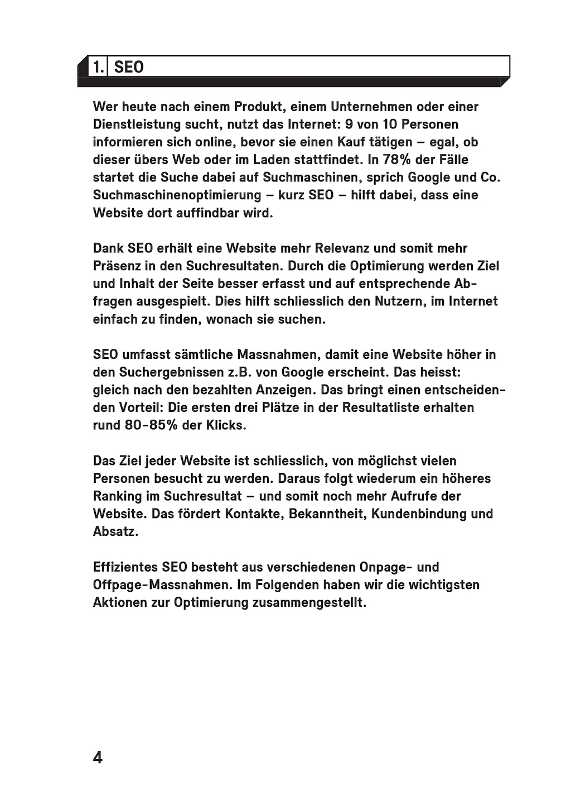

## Maxomedia: Agency Job Swap

Die Website Agency Job Swap entstand bei meiner Zeit als Textpraktikantin bei der Maxomedia. Damit soll der Austausch zwischen Mitarbeitenden internationaler Werbeagenturen gefördert werden. Ich erfand den Namen für das Projekt, konzipierte es zusammen mit dem Grafiker Christoph Gerber und schrieb alle Texte auf Englisch.

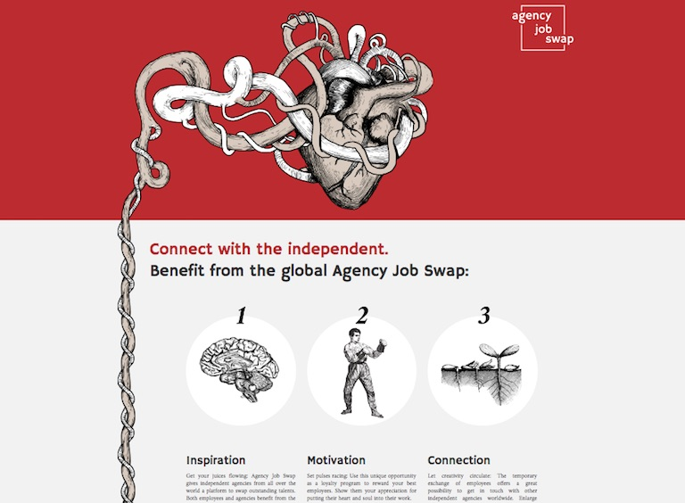
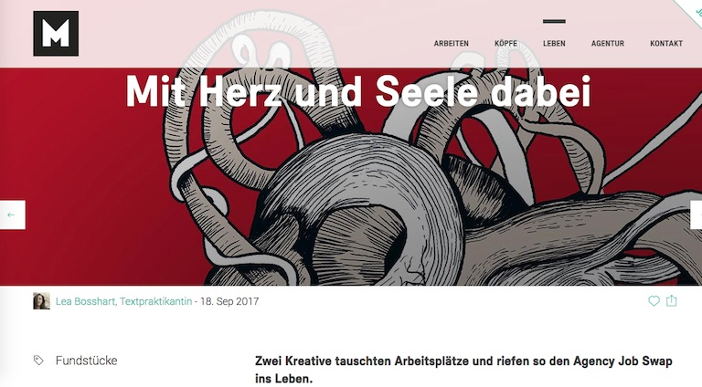

## Maxomedia: MAX-Bier

Als Weihnachtsgeschenk für unsere Kunden liessen wir bei einer Berner Craft-Bier-Brauerei ein extra Maxomedia-Bier namens MAX brauen. In einem kleinen Team konzipierten wir das Projekt gemeinsam. Ich verfasste zudem alle Texte.

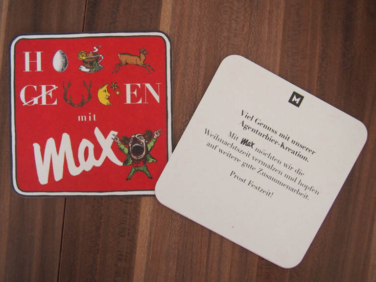
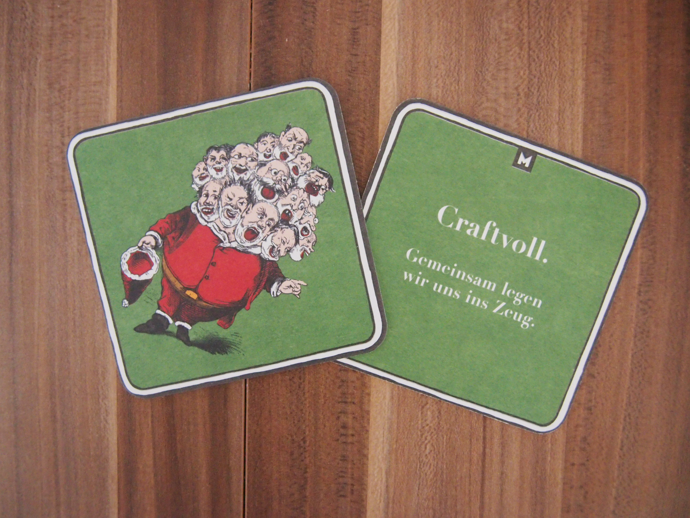
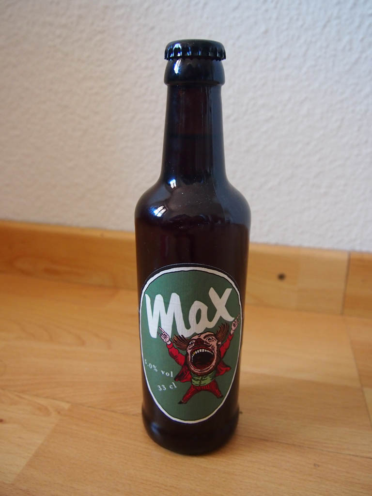
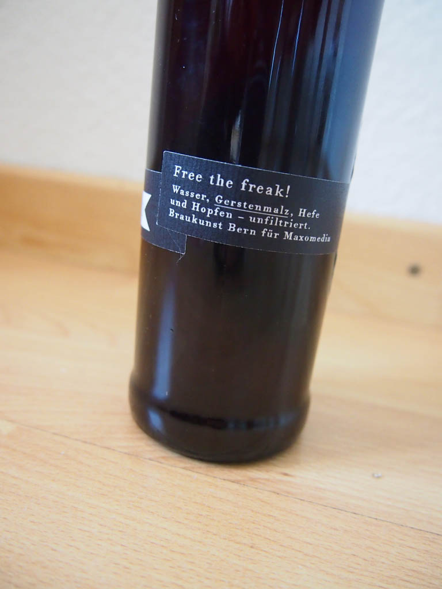

## Spoon: Suppen-Leporello

In ansprechendem, silbrigem Siebdruck, eigenwillig gestaltet und kräftig getextet: Zusammen mit der Grafikerin Christine Kaufmann [NEKA](https://neka.ch/){:target="_blank"}, dem Illustrator [Stephan Liechti](http://s-liechti.ch/){:target="_blank"} und dem Siebdrucker [Hanspeter Arni](http://arnisiebdruck.ch/){:target="_blank"} entstand dieses kleine und feine Leporello. Es vereint die leckersten Suppenrezepte von Caroline Kolb und Nicole Schmutz, Inhaberinnen des Restaurants Spoon in Basel.

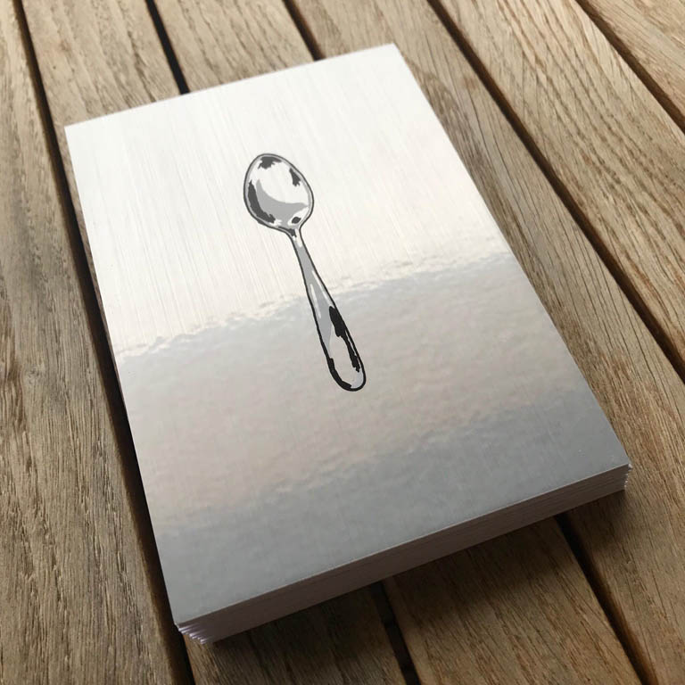
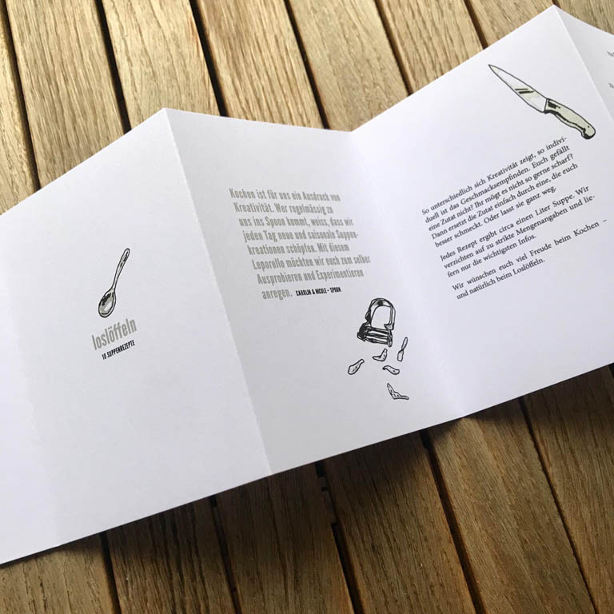
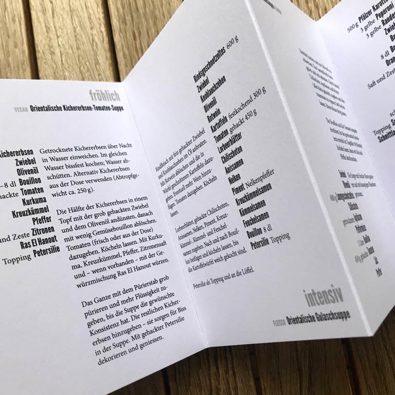

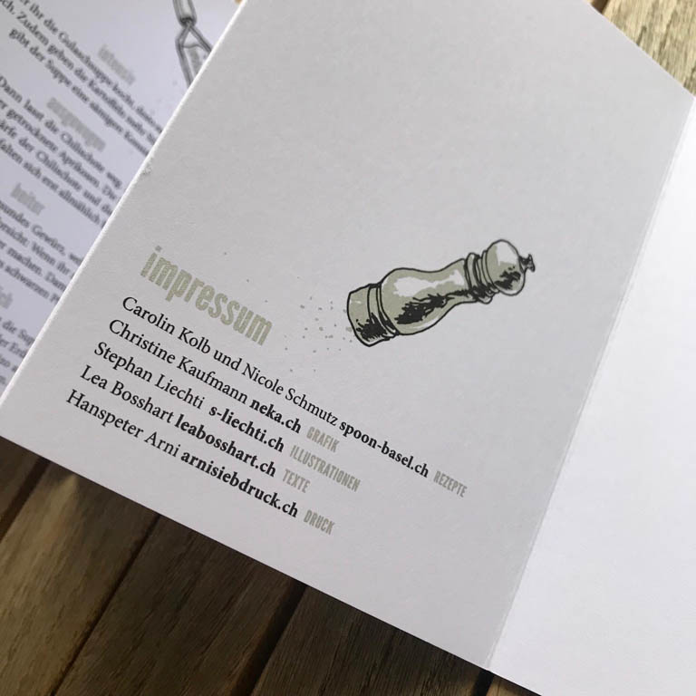
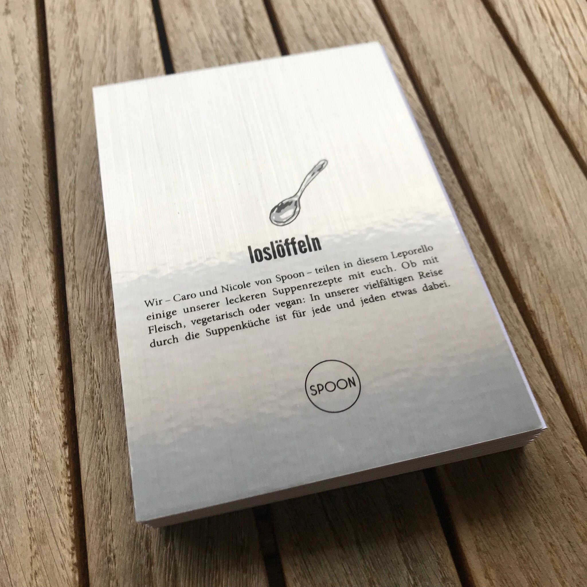
